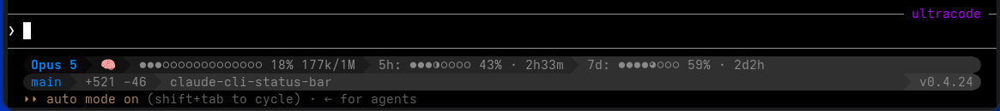

# claude-cli-status-bar



A native [statusLine](https://docs.claude.com/en/docs/claude-code/statusline)
renderer for Claude Code, written in Go. ccsb reads the JSON payload Claude
Code emits on each status update and prints a Powerline-styled status line
directly — a single fast binary, no Node round-trip per update. Every payload
is captured to disk for later inspection, schema drift in the inbound JSON is
detected and logged automatically, and a transparent proxy mode is available
for compatibility with existing setups (see [Background](#background)).

> **Status:** `0.4.11` — stable and actively developed (`0.3.0` added the
> `ccsb-wizard` config skill; `0.4.0` added configurable bar glyphs,
> per-part bar/label colour, token-fraction placement, and an opt-in
> `git_dirty` segment; `0.4.4` added the `ccsb captures clean` verb; `0.4.8`
> added the `ccsb update` self-updater and its `⊘` blocked indicator;
> `0.4.10` added the opt-in `update.auto` config block that lets the
> renderer run `ccsb update` for you; `0.4.11` closed two paths that could
> destroy the statusLine ccsb had promised to restore; `0.4.12` stopped
> `ccsb doctor` from deleting a proxy command it only failed to resolve;
> `0.4.13` corrected the `ccsb-wizard` skill against the real config schema
> and added tests that keep it there).
> The native renderer is the
> primary mode: a fully configurable Powerline pipeline with an
> out-of-the-box default layout (model + mode + context bar + 5h/7d
> rate-limit bars + git branch + lines diff + cwd + version stamp +
> hidden-by-default schema-health indicator), per-segment right-align
> and configurable bar widths, terminal-size detection with automatic
> row-overflow reflow (segments marked `wrap: true` are lifted onto a
> new row when the parent row would overflow), and a four-rung
> schema-robustness ladder behind the indicator: per-segment
> isolated payload parsing, automatic `.diag` drift logging,
> persistent `schema_version` tracking, and a `ccsb doctor`
> schema-drift diff against the most recent capture. Compatibility-mode
> proxying to an existing `statusLine` command is supported as a
> fallback and is seeded automatically by `ccsb install` when a
> non-trivial existing entry is present.

## What it does

- **Native renderer** — renders the status line directly from the JSON
  payload. Rows and segments (`model`, `context`, `cost`, `duration`,
  `lines`, `cwd`, `git_branch`, `git_dirty`, `limit_5h`, `limit_7d`,
  `mode`, `effort`, `session_name`, `output_style`, `tty_size`, `version`,
  `schema_health`, `text`) are configurable. The default layout (used when no config file
  exists) is two-row Powerline with round end caps: row 1 carries model +
  mode glyph + context bar + 5h/7d rate-limit bars + a hidden-by-default
  schema-health indicator; row 2 carries git branch + lines diff + cwd
  and a right-aligned version stamp. Percentage segments escalate fg at
  70 % (amber) and 90 % (red).
- **Schema robustness** — per-segment isolated payload parsing contains
  any type error in one upstream field to that field only, so the rest of
  the bar keeps rendering. When the inbound JSON looks broken, a `.diag`
  file is written next to the capture with a stable plain-text dump of
  the issue (top-level parse error, missing critical fields, per-field
  unmarshal errors, additive keys). The last seen `schema_version` is
  persisted under `$XDG_STATE_HOME/ccsb/schema_version` so any upstream
  schema bump appears as an explicit transition in the next `.diag`.
- **Capture** — every invocation writes the raw stdin JSON to
  `$XDG_STATE_HOME/ccsb/captures/<RFC3339Nano>-<session_id>.json`, the
  rendered statusLine bytes to `.out`, any proxy stderr to `.err`, and
  any schema-drift diagnostic to `.diag` — all sharing the same basename
  so input, output, and diagnostic can be paired.
- **Hook management** — `ccsb install` swaps the `statusLine` entry in
  `~/.claude/settings.json` with the path to this binary and saves the
  previous value verbatim; `ccsb uninstall` restores it byte-for-byte;
  `ccsb doctor` auto-installs if the hook drifted, switches to native
  mode if the proxy target is circular or cannot be resolved to an
  executable (resolved through `PATH`, so a bare `npx` counts as found),
  and reports schema drift against the latest capture.
- **Mode + config** — `ccsb mode native` clears the proxy block;
  `ccsb mode proxy [cmd args]` reinstates it (defaulting to the
  same command the install heuristic recognises, for symmetry);
  `ccsb mode` prints the active mode; `ccsb config reset` moves the
  user config aside (timestamped backup) so the next run picks up
  the in-code defaults, while carrying over the uninstall backup of
  your previous statusLine — that is state ccsb owes you back, not a
  setting to reset.
- **Proxy mode (compatibility)** — when a proxy command is configured,
  ccsb forwards the stdin payload to it and prints its stdout verbatim.
  Useful for setups that already have a different statusLine renderer in
  place — ccsb sits in front of it for capture and schema-drift logging
  while the existing renderer keeps driving the visible bar.
- **Self-update** — `ccsb update` replaces the running binary with the
  newest GitHub release. It uses `go install` when a Go toolchain is on
  `$PATH` and the running binary lives in `GOBIN`; otherwise, or if
  `go install` fails, it downloads the release archive and verifies it
  against the release's `checksums.txt` (this catches a corrupted
  download, not a compromised release — the checksum file ships from the
  same place as the archive). It refuses on Windows, on binaries built
  from a local checkout rather than installed from a tagged release, and
  when the target directory is not writable; `ccsb doctor` names which.
  Upgrading *from* 0.4.7 or earlier is a manual download: those builds
  carried VCS metadata that `ccsb update` reads as a local build and
  refuses to overwrite, so they cannot update themselves. Swap the binary
  by hand once and self-update works from then on.
  Set `{"update": {"auto": "patch"}}` in the config to let ccsb install
  matching releases by itself; it is off unless you say so.

## Install

For tagged releases the easiest path is a pre-built binary from the
[GitHub Releases page](https://github.com/bsmr/claude-cli-status-bar/releases):
Linux (amd64, arm64), macOS (amd64, arm64), and Windows (amd64) are
built automatically by the release pipeline. Download the archive
for your OS+arch, extract `ccsb` to anywhere on `$PATH`, then run
`ccsb install` to hook it into Claude Code.

### Build from source

The Go module path is `go.muehmer.eu/claude-cli-status-bar`.
Recommended for Linux and macOS — Windows users should prefer the
pre-built binary from the
[GitHub Releases page](https://github.com/bsmr/claude-cli-status-bar/releases)
rather than building from source.

```bash
git clone https://github.com/bsmr/claude-cli-status-bar.git
cd claude-cli-status-bar
go install ./cmd/ccsb                          # installs to $GOBIN or ~/go/bin
# or build a local artifact:
go build -o bin/ccsb ./cmd/ccsb
install -m 0755 bin/ccsb ~/.local/bin/ccsb     # or anywhere on $PATH
```

The vanity URL resolves directly, so you can install a tagged release
without cloning:

```bash
go install go.muehmer.eu/claude-cli-status-bar/cmd/ccsb@vX.Y.Z   # or @latest
```

The version segment's string is resolved at startup: a downloaded release
archive carries the version injected at build time via an `-X` ldflag,
while a `go install` of a tagged version or a local `go build` from a
checked-out tag reports the tag `runtime/debug.ReadBuildInfo()` stamps
(`v0.4.8`). An untagged build reports `dev` — Go's `(devel)` placeholder
is discarded — and the `version` segment then renders a skull marker
instead of a version. Check out the tag you want shipped if you care
about the stamp.

When `check_update` is enabled (the default in ccsb's own shipped layout —
the Go zero value is `false`, so a hand-written or wizard-generated config
must set it explicitly), the version segment also checks GitHub for a
newer release and appends `" (↑ v<latest>)"` — see
`docs/configuration.md` for the full color-escalation table. The check
runs out-of-band (a detached `ccsb refresh-update-check`, cached and
rate-limited like the `git_dirty` segment's refresher) and never delays
a render.

Requires Go 1.26.3 or newer (see `go.mod`).

## Use

```bash
ccsb install      # save current statusLine, replace it with ccsb
ccsb mode         # print current mode (native or proxy)
ccsb mode native  # clear proxy block so the native renderer drives ccsb
ccsb mode proxy   # restore proxy mode (default: npx -y ccstatusline@latest)
ccsb config reset # move config.json aside (timestamped backup); defaults apply
                  # (the uninstall backup is carried over, not reset)
ccsb captures clean               # remove captured payloads and output
ccsb captures clean --older-than 7d  # ... keeping anything newer
ccsb status       # print resolved paths, hook state, mode, proxy/backup
ccsb doctor       # diagnose and auto-fix install/proxy problems, check schema drift
ccsb update       # replace this binary with the newest GitHub release
ccsb install-skill   # install the ccsb-wizard configuration skill
ccsb uninstall-skill # remove it again
ccsb uninstall    # restore the previous statusLine byte-for-byte
ccsb version      # print the version (aliases: -v, --version)
ccsb help         # subcommand summary (aliases: -h, --help)
```

On the **first** install — while ccsb is not yet hooked and its config
still holds no backup —
`install` saves the existing `statusLine` value verbatim into ccsb's config
as the backup and seeds the proxy command from the same value. Every
install rewrites `statusLine.command` to the absolute path of the ccsb
binary; other top-level keys in `settings.json` are preserved. Once a
backup exists, a re-run leaves both the backup and the proxy block
untouched — from then on the proxy block is managed with `ccsb mode`.

On that first install, if the existing entry matches the canonical
`npx -y ccstatusline@latest` invocation (a common predecessor — see
[Background](#background)), `install` lands directly in native mode:
the backup is preserved for `uninstall`, no proxy command is
configured, and the in-binary renderer drives the status line. For any
other command, the existing argv is seeded as `proxy.command` /
`proxy.args` so ccsb keeps forwarding to it. Switch mode any time with
`ccsb mode native` or `ccsb mode proxy <cmd args>`.

`uninstall` only proceeds when `statusLine` currently points at this binary —
manual edits since install are never overwritten.

### AI configuration wizard (optional)

If you use Claude Code, install the AI-powered configuration wizard:

```bash
ccsb install-skill
```

This writes `~/.claude/skills/ccsb-wizard/SKILL.md` — the layout Claude Code
discovers personal skills in. Inside Claude Code, type `/ccsb-wizard` to start
an interactive configuration dialogue. Claude reads your current config, checks
your NerdFont setup, and adjusts the display through natural-language questions.

Re-run `ccsb install-skill` after updating ccsb to get the latest skill version.
Installs before 0.4.6 wrote a flat `ccsb-wizard.md` that Claude Code never
recognised as a skill; re-running removes that leftover automatically.

To remove:

```bash
ccsb uninstall-skill
```

## File locations

| Purpose | Path |
| --- | --- |
| Claude Code settings | `~/.claude/settings.json` |
| ccsb config | `${XDG_CONFIG_HOME:-$HOME/.config}/ccsb/config.json` |
| Captures | `${XDG_STATE_HOME:-$HOME/.local/state}/ccsb/captures/` |

The config file holds the proxy command/args plus a verbatim backup of the
previous `statusLine` value so `uninstall` can restore it. The `render`
section and the full segment vocabulary are documented in
[`docs/configuration.md`](docs/configuration.md).

The capture directory is append-only: every status update writes one to four
files into it (`.json` always, plus `.out`, `.err` and `.diag` when non-empty),
so it grows until you clear it. Only `ccsb doctor` ever reads a capture back,
and only the newest one — removing the rest is safe at any time:

```bash
ccsb captures clean                     # remove all captures
ccsb captures clean --older-than 7d     # keep the last week (also accepts 24h, 90m)
```

Only files whose name *starts* with an RFC3339 UTC timestamp are considered,
so `notes.txt` survives — but anything you name with a leading timestamp is
treated as a capture and removed. Keep your own files elsewhere, or give them
a name that does not start with one.

## Roadmap

- **0.1.x** — proxy mode, capture, install/uninstall machinery, the
  configurable native renderer, and the `ccsb mode` subcommand.
- **0.2.x** — Powerline rendering with row-bg fill, chevron transitions,
  opt-in end caps, terminal-size detection with automatic row-overflow
  reflow and per-segment dynamic `shrink`, auto-detected version
  segment, row- and per-segment right-alignment, per-segment
  configurable bar widths, a full Powerline default layout out of the
  box, submodule-aware `git_branch` scope resolution, a `ccsb config
  reset` subcommand, a four-rung schema-robustness ladder (per-segment
  isolated parsing, `.diag` drift logger, `ccsb doctor` schema-check,
  persistent `schema_version` tracking), and a GoReleaser + GitHub
  Actions release pipeline (every `v*.*.*` tag builds the cross-platform
  binaries and publishes a Release; every push or PR runs `gofmt`,
  `go vet` and `go test -race -cover`). **Feature-complete as of
  `0.2.37` — subsequent `0.2.x` releases are bugfix-only.**
- **0.3.x** — the `ccsb-wizard` Claude Code skill: an opt-in, AI-guided
  configuration dialogue installed with `ccsb install-skill` and started
  with `/ccsb-wizard` inside Claude Code.
- **0.4.x** — render options contributed from real-world use: configurable
  bar glyphs (`bar_glyphs` / `bar_style`), independent colour for a bar and
  its label (`bar_fg` / `label_fg` with their own thresholds), placement of
  the token fraction (`token_position`), an opt-in `git_dirty` segment
  that keeps the render path free of blocking git calls by refreshing a
  cached count out of band, and a version segment that flags available
  GitHub releases with escalating color. `0.4.3` acted on a full-codebase
  review — dead
  code removed, an install-backup bug fixed, the background `git status`
  hardened, and CI extended with a pinned `staticcheck` plus a
  windows/darwin cross-compile matrix. `0.4.4` added `ccsb captures clean`
  so the capture directory no longer grows without bound.

## Background

ccsb started as a thin Go proxy in front of an existing `statusLine`
command, so the JSON payload Claude Code emits on every status update
could be captured and inspected locally before reaching the downstream
renderer. The common predecessor on this hook at the time was
`npx -y ccstatusline@latest`, a Node-based renderer — which is why
ccsb still recognises that specific command on `install` and switches
straight to native mode (its own renderer covers the same ground
without the Node round-trip on every update).

The surrounding code then grew to validate, diagnose, and eventually
render the payload itself, and ccsb became a standalone statusLine
renderer. The proxy path is preserved as a compatibility option so
setups that already have a different renderer wired up keep working
unchanged while ccsb sits in front of it for capture and schema-drift
logging.

## Develop

```bash
go test -race -cover ./...   # all tests
go vet ./...
go run honnef.co/go/tools/cmd/staticcheck@v0.7.0 ./...   # version pinned, same as CI
gofmt -l .                   # must be empty
go build -o bin/ccsb ./cmd/ccsb
```

See [`CLAUDE.md`](CLAUDE.md) for the package layout, data flow, and
contributor conventions.

## License

MIT — see [`LICENSE`](LICENSE).
